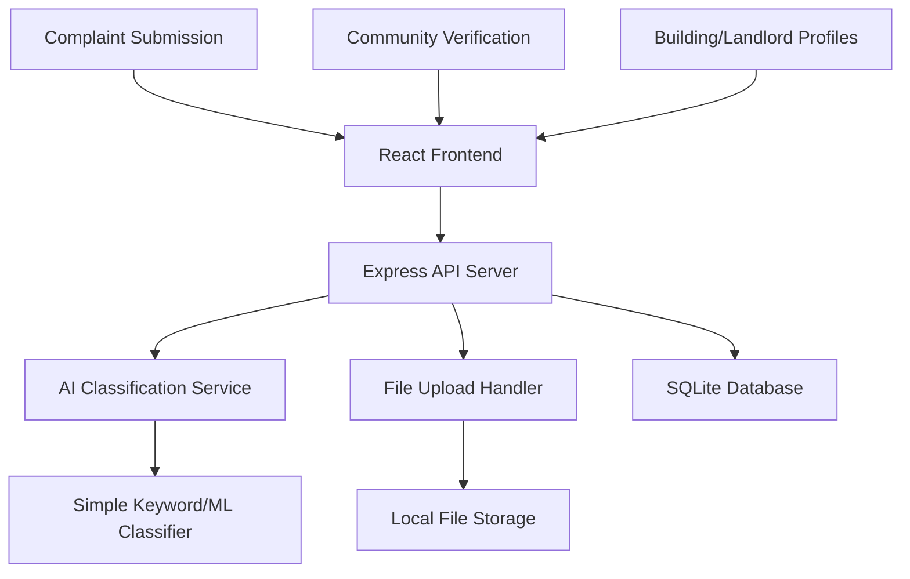

# Design Document: Tenant Intelligence System

## Overview

The Tenant Intelligence System is a demo-ready web application that enables anonymous tenant complaint submission with AI-powered classification and community verification. The system prioritizes working functionality for hackathon demonstrations, using a modern web stack with React frontend, Node.js/Express backend, and SQLite database.

The architecture emphasizes simplicity and rapid development while maintaining basic anonymity through random IDs and minimal data collection. The focus is on core features that can be built and demonstrated quickly rather than enterprise-grade privacy systems.

## Architecture

### High-Level Architecture



### Component Overview

- **React Frontend**: Single-page application with clean, mobile-friendly UI
- **Express API Server**: RESTful API handling all business logic and data operations
- **AI Classification Service**: Simple text analysis for categorizing complaints into 4 types
- **File Upload Handler**: Image upload and storage management
- **SQLite Database**: Lightweight database perfect for demos and prototypes
- **Local File Storage**: Simple file system storage for uploaded images

## Components and Interfaces

### AI Classification Service

**Purpose**: Automatically categorizes complaint text into predefined issue types.

**Key Functions**:
- Text analysis using keyword matching or simple ML model
- Classification into Safety, Maintenance, Sanitation, Utilities
- Confidence scoring for classification results
- Fallback to manual categorization when confidence is low

**Interface**:
```typescript
interface AIClassifier {
  classifyComplaint(text: string): ClassificationResult
  getConfidenceScore(text: string, category: IssueCategory): number
  trainModel?(trainingData: TrainingExample[]): void
}

interface ClassificationResult {
  category: IssueCategory
  confidence: number
  suggestedCategories: IssueCategory[]
}
```

### Complaint Management Service

**Purpose**: Handles complaint lifecycle, status updates, and community verification.

**Key Functions**:
- Complaint submission with text and image handling
- Status lifecycle management (Reported → Under Review → Resolved/Dismissed)
- Community upvoting and evidence submission
- Basic anonymization through random ID generation

**Interface**:
```typescript
interface ComplaintService {
  submitComplaint(complaint: ComplaintSubmission): Promise<ComplaintResponse>
  updateStatus(complaintId: string, status: ComplaintStatus): Promise<void>
  addUpvote(complaintId: string): Promise<void>
  addEvidence(complaintId: string, evidence: Evidence): Promise<void>
  getComplaints(filters: ComplaintFilters): Promise<Complaint[]>
}
```

### Profile Aggregation Service

**Purpose**: Creates building and landlord profiles from aggregated complaint data.

**Key Functions**:
- Building profile generation with complaint statistics
- Landlord profile creation across multiple properties
- Trend analysis and pattern identification
- Summary statistics for decision-making

**Interface**:
```typescript
interface ProfileService {
  getBuildingProfile(address: string): Promise<BuildingProfile>
  getLandlordProfile(landlordId: string): Promise<LandlordProfile>
  getComplaintTrends(timeRange: TimeRange): Promise<TrendData>
  getStatistics(filters: StatisticsFilters): Promise<Statistics>
}
```

## Data Models

### Core Data Structures

```typescript
interface Complaint {
  id: string                    // Random UUID
  buildingAddress: string       // Full building address
  description: string           // Complaint text
  category: IssueCategory      // AI-classified or user-selected
  status: ComplaintStatus      // Current lifecycle status
  imageUrl?: string            // Optional uploaded image
  upvotes: number              // Community verification count
  evidence: Evidence[]         // Supporting evidence from community
  createdAt: Date             // Submission timestamp
  updatedAt: Date             // Last status change
  landlordInfo?: {
    name: string
    contactInfo?: string
  }
}

interface Evidence {
  id: string
  complaintId: string
  description: string
  imageUrl?: string
  createdAt: Date
}

interface BuildingProfile {
  address: string
  totalComplaints: number
  complaintsByCategory: Record<IssueCategory, number>
  complaintsByStatus: Record<ComplaintStatus, number>
  averageResolutionTime: number
  recentComplaints: Complaint[]
  landlordInfo?: LandlordInfo
}

interface LandlordProfile {
  id: string
  name: string
  properties: string[]
  totalComplaints: number
  complaintsByCategory: Record<IssueCategory, number>
  averageResolutionTime: number
  responseRate: number
}

enum IssueCategory {
  SAFETY = 'Safety',
  MAINTENANCE = 'Maintenance', 
  SANITATION = 'Sanitation',
  UTILITIES = 'Utilities'
}

enum ComplaintStatus {
  REPORTED = 'Reported',
  UNDER_REVIEW = 'Under Review',
  RESOLVED = 'Resolved',
  DISMISSED = 'Dismissed'
}
```

### Database Schema (SQLite)

```sql
-- Complaints table
CREATE TABLE complaints (
  id TEXT PRIMARY KEY,
  building_address TEXT NOT NULL,
  description TEXT NOT NULL,
  category TEXT NOT NULL,
  status TEXT DEFAULT 'Reported',
  image_url TEXT,
  upvotes INTEGER DEFAULT 0,
  landlord_name TEXT,
  landlord_contact TEXT,
  created_at DATETIME DEFAULT CURRENT_TIMESTAMP,
  updated_at DATETIME DEFAULT CURRENT_TIMESTAMP
);

-- Evidence table
CREATE TABLE evidence (
  id TEXT PRIMARY KEY,
  complaint_id TEXT NOT NULL,
  description TEXT NOT NULL,
  image_url TEXT,
  created_at DATETIME DEFAULT CURRENT_TIMESTAMP,
  FOREIGN KEY (complaint_id) REFERENCES complaints(id)
);

-- Status history table
CREATE TABLE status_history (
  id TEXT PRIMARY KEY,
  complaint_id TEXT NOT NULL,
  old_status TEXT,
  new_status TEXT NOT NULL,
  notes TEXT,
  changed_at DATETIME DEFAULT CURRENT_TIMESTAMP,
  FOREIGN KEY (complaint_id) REFERENCES complaints(id)
);
```

## Error Handling

### Input Validation Errors

- **Invalid File Formats**: When unsupported image formats are uploaded
- **File Size Limits**: When uploaded images exceed maximum size limits
- **Missing Required Fields**: When complaint submissions lack required information
- **Invalid Status Transitions**: When attempting invalid status changes

### Classification Errors

- **Low Confidence Classification**: When AI classifier cannot confidently categorize text
- **Classification Service Unavailable**: When AI service is temporarily unavailable
- **Invalid Category Selection**: When manual category selection uses invalid values

### Database Errors

- **Connection Failures**: When SQLite database is unavailable or corrupted
- **Constraint Violations**: When data violates database constraints
- **Concurrent Access Issues**: When multiple users modify the same data simultaneously

### System Resilience

- Graceful degradation when AI classification fails (fallback to manual selection)
- Clear error messages for users without exposing system internals
- Automatic retry mechanisms for transient database failures
- Fallback to basic functionality when advanced features are unavailable

## Testing Strategy

### Dual Testing Approach

The system requires both unit testing and property-based testing to ensure correctness:

**Unit Tests**: Focus on specific examples, edge cases, and integration points
- Specific complaint submission scenarios
- Image upload with various file formats and sizes
- Status transition workflows
- Database integration and error conditions
- UI component behavior and user interactions

**Property Tests**: Verify universal properties across all inputs
- Data collection and storage consistency
- Classification accuracy and completeness
- Community verification integrity
- Profile aggregation correctness
- File handling robustness

**Property-Based Testing Configuration**:
- Use fast-check (TypeScript/JavaScript) for property testing
- Minimum 100 iterations per property test
- Each test tagged with: **Feature: tenant-intelligence-system, Property {number}: {property_text}**
- Focus on data integrity and user workflow properties

**Testing Priorities**:
1. Core complaint submission and storage
2. AI classification accuracy and fallbacks
3. Community verification and upvoting
4. Profile generation and aggregation
5. File upload and image handling

## Correctness Properties

*A property is a characteristic or behavior that should hold true across all valid executions of a system—essentially, a formal statement about what the system should do. Properties serve as the bridge between human-readable specifications and machine-verifiable correctness guarantees.*

Based on the prework analysis and property reflection, the following properties ensure the system maintains data integrity while providing accurate complaint tracking and community features:

### Property 1: Comprehensive Data Collection and Storage
*For any* valid complaint submission with text and optional image, the system should store exactly the specified fields (building address, complaint text, optional image) and assign a unique random ID, while rejecting any additional data.
**Validates: Requirements 1.2, 1.3, 1.4**

### Property 2: Complete AI Classification Workflow
*For any* complaint text submission, the system should analyze it using AI classification, assign one of the four valid categories (Safety, Maintenance, Sanitation, Utilities), display the result to the user, and store both AI-assigned and any user-confirmed categories.
**Validates: Requirements 2.1, 2.2, 2.3, 2.5**

### Property 3: Status Lifecycle Consistency
*For any* complaint, the initial status should be "Reported", and all subsequent status changes should only use valid values ("Under Review", "Resolved", "Dismissed") while maintaining a complete history of all transitions.
**Validates: Requirements 3.1, 3.2, 3.5**

### Property 4: Community Verification Integrity
*For any* complaint, anonymous upvoting should increment the count correctly, display accurate verification information, and prevent multiple votes from the same browser session.
**Validates: Requirements 4.1, 4.3, 4.5**

### Property 5: Evidence Linking Consistency
*For any* evidence submission, it should be properly linked to the original complaint and remain associated throughout the system lifecycle.
**Validates: Requirements 4.2, 4.4**

### Property 6: Profile Aggregation Accuracy
*For any* building or landlord, the system should correctly group complaints by address, aggregate counts by category and status, and generate accurate profiles across multiple properties when landlord information is provided.
**Validates: Requirements 5.1, 5.2, 5.3**

### Property 7: Statistical Calculation Correctness
*For any* set of complaints, the system should accurately calculate trends over time, identify most common issues, and compute average resolution times from the underlying data.
**Validates: Requirements 5.4, 5.5**

### Property 8: Responsive Design Functionality
*For any* viewport size or device type, the system interface should maintain core functionality and usability across different screen dimensions.
**Validates: Requirements 6.5**

### Property 9: Data Persistence and Retrieval
*For any* complaint stored in the SQLite database, it should be retrievable with all original data intact, and profile generation should accurately aggregate data from stored complaints.
**Validates: Requirements 7.1, 7.3**

### Property 10: List Operations Consistency
*For any* complaint list, sorting and filtering operations should work correctly across different criteria while maintaining data integrity.
**Validates: Requirements 7.4**

### Property 11: Comprehensive File Handling
*For any* image upload, the system should accept valid formats (JPG, PNG, WebP), reject invalid formats and oversized files, store accepted images securely, and provide proper preview functionality during submission.
**Validates: Requirements 8.1, 8.2, 8.4, 8.5**

### Property 12: Image Display Consistency
*For any* complaint with uploaded images, the system should display them in a user-friendly format that maintains image quality and accessibility.
**Validates: Requirements 8.3**

### Property 13: Classification Confidence Handling
*For any* complaint text with low classification confidence, the system should provide manual category selection options while maintaining the ability to store both AI and user selections.
**Validates: Requirements 2.4**

### Property 14: Resolution Notes Functionality
*For any* complaint being resolved, the system should allow optional resolution notes to be added and stored with the status change.
**Validates: Requirements 3.4**

### Property 15: Status and Timestamp Display
*For any* complaint display, the system should show the current status and timestamp of the last update accurately.
**Validates: Requirements 3.3**